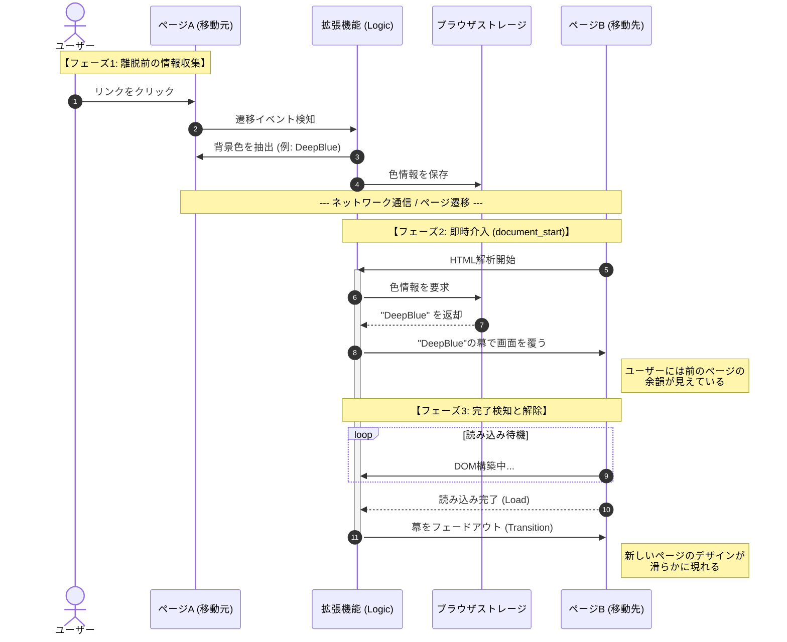
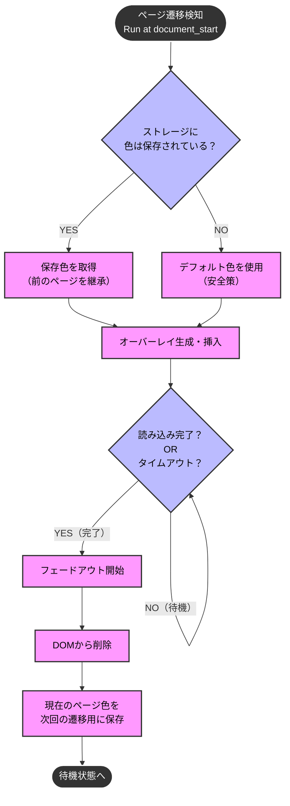

# ブラウザ拡張機能 要件定義書

| 項目 | 内容 |
| :--- | :--- |
| **プロジェクト名** | **Seamless Transition (シームレス・トランジション)** |
| **対象プラットフォーム** | Chromiumベースブラウザ (Chrome, Edge, Vivaldi等) |
| **開発目的** | ページ遷移時に発生する「Flash of Unstyled Content (FOUC)」およびブラウザ既定背景色による「ちらつき」を排除し、視覚的な中断のないスムーズなブラウザ体験を提供する。 |

---

## 1. 現状の課題と解決方針

### 1.1. 課題 (Pain Points)
*   **初期描画のちらつき:** ブラウザはページ遷移時、新しいコンテンツを読み込むまでの間、既定の色（黒または白）で画面をクリアする。これがサイト側の指定色（テーマカラー）と異なる場合、一瞬の激しい明滅（フラッシュ）として知覚され、ユーザーに不快感を与える。
*   **制御不能なタイムラグ:** Vivaldi等のブラウザ設定やカスタムCSSでは、レンダリングエンジンの初期挙動（空白画面）までは制御できない。

### 1.2. 解決方針 (Solution Strategy)
*   **DOMライフサイクルへの介入:** ブラウザ拡張機能の権限を用い、レンダリングエンジンの描画プロセスに**最速のタイミング**で介入する。
*   **オーバーレイ方式:** コンテンツの読み込みが完了するまでの間、画面全体を覆う「幕（オーバーレイ）」を強制的に表示する。
*   **動的カラー継承 (Color Inheritance):** 前のページの背景色を次のページへ「継承」させることで、ページが切り替わったことをユーザーに意識させないシームレスな遷移を実現する。

---

## 2. 機能要件 (Functional Requirements)

### 2.1. 色情報の永続化と継承
*   **離脱時の色取得:** ユーザーがページ遷移（リンククリック等）を行う際、現在のページの主要な背景色を動的に解析・取得する。
*   **ストレージ保存:** 取得した色情報をブラウザのストレージ領域に一時保存し、ページ遷移後も参照可能な状態にする。

### 2.2. 即時レンダリング制御（オーバーレイ）
*   **最速実行 (`document_start`):** 次のページのHTML解析開始と同時（DOM構築前）にスクリプトを実行する。
*   **動的オーバーレイ生成:**
    *   ストレージから「前のページの色」を読み出し、その色で塗りつぶした`div`要素（幕）を生成する。
    *   生成した要素をDOMツリーの最上位（`html`または`body`直下）に挿入し、画面全体を遮蔽する。
*   **フォールバック処理:** 初回起動時や別タブでの展開など、「前のページ」が存在しない場合は、予め設定された「デフォルト色（例：ダークグレー）」を適用し、白飛びを防止する。

### 2.3. 読み込み完了検知と解除アニメーション
*   **完了監視:** `DOMContentLoaded` または `window.onload` イベントを監視し、サイトの描画準備完了を検知する。
*   **フェードアウト:** 準備完了後、即座に幕を消すのではなく、CSSトランジションを用いて不透明度（opacity）を徐々に下げ、滑らかにコンテンツを表示させる。

---

## 3. 非機能要件 (Non-Functional Requirements)

*   **パフォーマンス:** 拡張機能のスクリプトは軽量化し、メインスレッドをブロックしないこと。人間の目で知覚できる「描画の隙」を作らない処理速度を確保する。
*   **安全性 (Fail-safe):** ネットワーク遅延等でページの読み込みが完了しない場合でも、一定時間（例：3秒）経過後に強制的にオーバーレイを解除する「タイムアウト機能」を実装し、操作不能状態を回避する。
*   **UX品質:** ユーザーが変化に気づかないレベルの自然なアニメーション（0.2秒〜0.5秒程度）を設定する。

---

## 4. システム設計図

### 4.1. シーケンス図（処理の時系列フロー）
ページAからページBへ遷移する際の、ブラウザと拡張機能のインタラクションを示します。

### 4.2. フローチャート（プログラム判断ロジック）
拡張機能起動時の内部ロジックと、例外処理（デフォルト色の適用、タイムアウト）の流れを示します。

---

## 5. 技術的成果・アピールポイント

本システムの開発における技術的なハイライトは以下の通りです。

1.  **ブラウザレンダリングへの介入:**
    通常のWeb開発では触れることのない「ページ描画前」のタイミングを制御し、ブラウザ既定の挙動（ホワイトフラッシュ）をオーバーライドすることに成功している。
2.  **State Persistence（状態の永続化）の応用:**
    HTTPプロトコルのステートレス性を超え、クライアントサイドストレージを用いることで、ページ間で視覚情報（色）を受け渡すUXパターンを確立した。
3.  **知覚パフォーマンスの向上:**
    物理的な通信速度を変えることなく、人間の脳の特性（変化の連続性）を利用して、体感的な待ち時間を短縮させる高度なUXデザインを実装した。